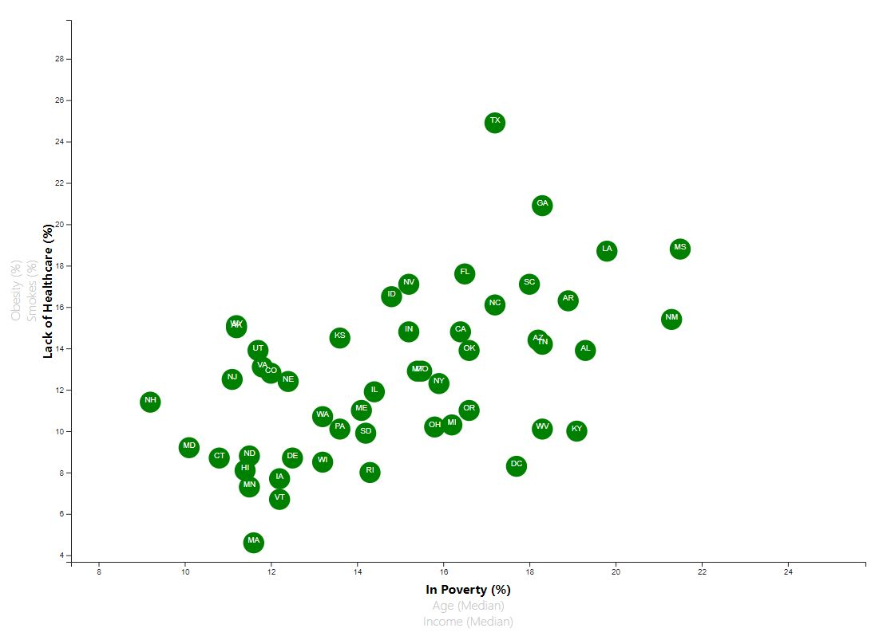

# D3-Challenge - Data Journalism and D3

## Background

Welcome to the newsroom! Having accepted a data visualization position for a major metro paper, the mission is analyzing the current trends shaping people's lives, as well as creating charts, graphs, and interactive elements to help readers understand significant findings.

The editor wants to run a series of feature stories about the health risks facing particular demographics. Counting on this data analytics team, the editor desires the team to sniff out the first story idea by sifting through information from the U.S. Census Bureau and the Behavioral Risk Factor Surveillance System.

The data set included with the assignment is based on 2014 ACS 1-year estimates from the [US Census Bureau](https://data.census.gov/cedsci/). The current data set includes data on rates of income, obesity, poverty, etc. by each US State. MOE stands for "margin of error."

The finalized app has been deployed to github page. Click [here](https://jonathanezeugo.github.io/D3-Challenge/StarterCode/index.html) to view the rendered page.

### The mission: D3 Dabbler 

A scatter plot was created between two of the data variables such as `Healthcare vs. Poverty` or `Smokers vs. Age`. This scatter plot was created to represent each state with circle elements. A VS script was used to code this graphic in the `app.js` file and the data from `data.csv` was imported by using the `d3.csv` function. The scatter plot ultimately appeared like the image at the top of this section.

* Include state abbreviations in the circles.

* Create and situate your axes and labels to the left and bottom of the chart.

* Note: You'll need to use `python -m http.server` to run the visualization. This will host the page at `localhost:8000` in your web browser.

This challenge focuses on analyzing the current trends shaping people's lives, as well as creating charts, graphs, and interactive elements to help readers understand findings.
The goal is to run a series of feature stories about the health risks facing particular demographics. The visualization will help sniff out the first story idea by sifting through information from the U.S. Census Bureau and the Behavioral Risk Factor Surveillance System.